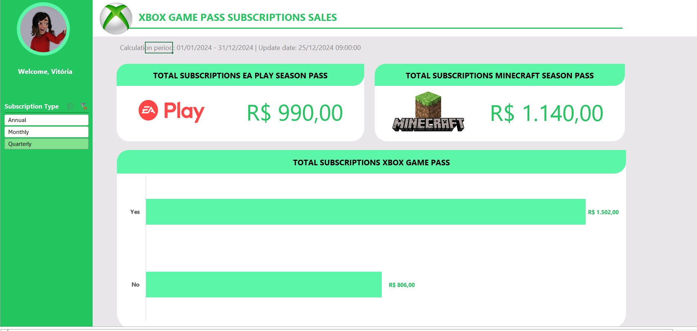

# xbox-sales-dio
# 🎮 Xbox Sales Dashboard

Dashboard desenvolvido para análise de vendas de assinaturas do Xbox Game Pass, incluindo pacotes adicionais como EA Play Season Pass e Minecraft Season Pass.

O projeto foi criado como parte de um desafio prático do bootcamp da DIO, com foco em visualização de dados, indicadores de vendas e construção de dashboards interativos.

---

## 📊 Objetivo do Projeto

Transformar dados de vendas em informações visuais claras e intuitivas, permitindo analisar:

- Total de assinaturas vendidas
- Receita gerada por Season Pass
- Comparação entre clientes com e sem Xbox Game Pass
- Tipos de assinatura mais utilizados
- Indicadores financeiros gerais

---

## 🛠️ Ferramentas Utilizadas

- Excel

---

## 📌 Indicadores Apresentados

### 🎯 KPIs principais

- Total de vendas EA Play Season Pass
- Total de vendas Minecraft Season Pass
- Receita total de assinaturas Xbox Game Pass

### 📈 Análises Visuais

- Comparativo entre usuários com e sem renovação automática (auto renewal)
- Filtro por tipo de assinatura:
  - Annual
  - Monthly
  - Quarterly

---

## 🎨 Layout do Dashboard

O dashboard foi desenvolvido utilizando a identidade visual do Xbox, buscando uma interface moderna, limpa e intuitiva.

---

## 🚀 Aprendizados

Durante o desenvolvimento deste projeto, foram trabalhados conceitos como:

- Criação de dashboards interativos
- Organização visual de informações
- Experiência do usuário
- Storytelling com dados

---

## 📷 Preview do Projeto
 

**Vitória Mesquita Rodrigues**  
Engenharia Química • Data Analytics • Power BI 📊✨
